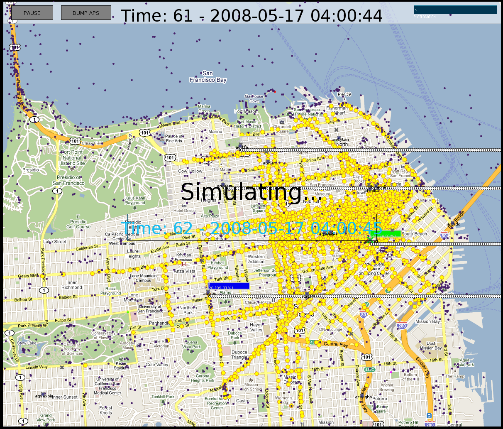

Metropolitan Advanced Network Simulator
=======================================

This is a graphical simulator used in the following publication:

Cellular traffic offloading through WiFi networks
Savio Dimatteo, Pan Hui, Bo Han, Victor OK Li
Presented at IEEE MASS 2011: The 8th IEEE International Conference on Mobile Ad-hoc and Sensor Systems, Valencia, Spain, 17-21 October, 2011

Please cite our paper if you are using this simulator!

For more information visit http://www.savio.dimatteo.it
